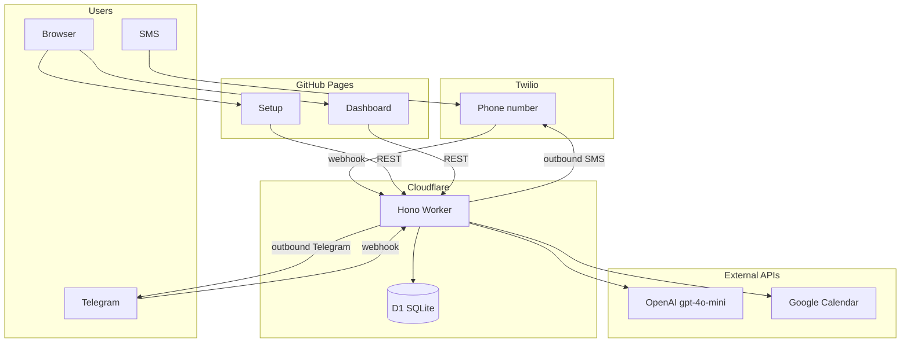

# SophieBot

[](https://github.com/sfkunal/SophieBot/actions/workflows/ci.yml)
[](https://github.com/sfkunal/SophieBot/actions/workflows/deploy-worker.yml)
[](https://github.com/sfkunal/SophieBot/actions/workflows/deploy-web.yml)

**SophieBot** is a shared assistant for two people — text her on SMS or Telegram to save restaurants, build a watchlist, vote on what's next, and check when you're both free on Google Calendar. Replies are warm and witty, not corporate.

- **Setup:** https://sfkunal.github.io/SophieBot/
- **API:** https://brain-worker.sophiebot.workers.dev
- **Product spec:** [docs/product.md](docs/product.md)

## What it does

| Channel | Use it for |
|---------|------------|
| **SMS** (Twilio) | Primary messaging — add items, ask for suggestions, check calendars |
| **Telegram** | Same commands, plus phone verification when SMS isn't ready |
| **Web** (GitHub Pages) | Onboarding, Google Calendar connect, dashboard |

Only **allowlisted phone numbers** (`ALLOWED_PHONES`) can sign up, use SMS, or access the API. Removing a number from the allowlist revokes access even if the user was previously registered. Random Telegram users get a static rejection — no OpenAI calls.

## Architecture



**SMS path:** Twilio webhook → intent extraction (OpenAI) → handler (D1) → reply composer (OpenAI) → outbound SMS.

**Web path:** Static Vite app on GitHub Pages calls the Worker API for auth, lists, and calendar data.

## Monorepo structure

```
SophieBot/
├── apps/
│   ├── worker/          # Cloudflare Worker (Hono, Twilio, Telegram, OpenAI, D1)
│   └── web/             # Vite static site (setup + dashboard) → GitHub Pages
├── packages/
│   └── shared/          # Types, Zod schemas, LLM prompts
├── docs/
│   └── product.md       # Product specification
├── .github/workflows/   # CI (test) + deploy pipelines
├── .env.example         # Local / wrangler secret reference
└── package.json         # npm workspaces root
```

| Package | Name | Role |
|---------|------|------|
| `packages/shared` | `@brain/shared` | Shared types, schemas, prompts |
| `apps/worker` | `@brain/worker` | API + messaging + cron on Cloudflare |
| `apps/web` | `@brain/web` | Setup and dashboard UI |

## Prerequisites

- Node.js 20+
- npm 10+
- [Cloudflare](https://dash.cloudflare.com/) account (Workers + D1)
- [Twilio](https://www.twilio.com/) account with an SMS-capable number (optional if using Telegram only)
- [OpenAI](https://platform.openai.com/) API key
- [Google Cloud](https://console.cloud.google.com/) OAuth client (Calendar scope)
- GitHub repo with Pages enabled

## Setup

### 1. Clone and install

```bash
git clone https://github.com/sfkunal/SophieBot.git
cd SophieBot
npm install
cp .env.example .env
```

### 2. Cloudflare D1

```bash
# Create database (note the database_id for wrangler.toml)
npx wrangler d1 create brain-db

# Update apps/worker/wrangler.toml with your database_id
npm run db:migrate -w @brain/worker          # local
npm run db:migrate:remote -w @brain/worker   # production
```

Includes `0005_security.sql` (telegram verify poll tokens, rate-limit buckets, vote dedup index). Re-run after pulling security changes.

### 3. Twilio (optional)

1. Buy or use an existing SMS number.
2. Set the messaging webhook to `https://<your-worker>.workers.dev/webhooks/twilio` (POST).
3. Copy Account SID, Auth Token, and phone number into secrets (see below).

### 4. Telegram (optional)

1. Create a bot via [@BotFather](https://t.me/BotFather).
2. Generate a webhook secret (`openssl rand -hex 32`) and set `TELEGRAM_WEBHOOK_SECRET`. The webhook **fails closed** (503) without it.
3. Set the webhook with `secret_token` matching that value:

   ```bash
   curl "https://api.telegram.org/bot<TOKEN>/setWebhook?url=https://<your-worker>.workers.dev/webhooks/telegram&secret_token=<TELEGRAM_WEBHOOK_SECRET>"
   ```

4. Store `TELEGRAM_BOT_TOKEN`, `TELEGRAM_WEBHOOK_SECRET`, and `TELEGRAM_BOT_USERNAME` via `wrangler secret put`.

### 5. OpenAI

Create an API key and set `OPENAI_API_KEY`. The worker uses `gpt-4o-mini` for intent extraction and reply composition.

### 6. Google OAuth

1. Create an OAuth 2.0 client (Web application).
2. Authorized redirect URI: `https://<your-worker>.workers.dev/api/auth/google/callback`
3. Enable the Google Calendar API.
4. Set `GOOGLE_CLIENT_ID`, `GOOGLE_CLIENT_SECRET`, and `GOOGLE_REDIRECT_URI`.
5. Calendar connect from the dashboard calls `GET /api/auth/google/start` with a **Bearer session token** (no `phone` query param).

### 7. Allowlist and auth

```bash
# Comma-separated E.164 numbers for the two of you (strictly enforced — delisting revokes access)
ALLOWED_PHONES=+15551234567,+15559876543

# Random 32+ char secret for dashboard sessions
AUTH_SECRET=<openssl rand -hex 32>
```

Onboard verify/confirm endpoints are rate limited (429 on excess). Telegram verification polling requires the `poll_token` returned from `POST /api/onboard/telegram-verify`.

### 8. Worker secrets (production)

```bash
cd apps/worker
npx wrangler secret put TWILIO_ACCOUNT_SID
npx wrangler secret put TWILIO_AUTH_TOKEN
npx wrangler secret put TWILIO_PHONE_NUMBER
npx wrangler secret put OPENAI_API_KEY
npx wrangler secret put GOOGLE_CLIENT_ID
npx wrangler secret put GOOGLE_CLIENT_SECRET
npx wrangler secret put ALLOWED_PHONES
npx wrangler secret put AUTH_SECRET
# Required when Telegram is enabled:
npx wrangler secret put TELEGRAM_BOT_TOKEN
npx wrangler secret put TELEGRAM_WEBHOOK_SECRET
npx wrangler secret put TELEGRAM_BOT_USERNAME
```

Update `[vars]` in `apps/worker/wrangler.toml`: `APP_URL`, `WEB_URL`, `GOOGLE_REDIRECT_URI`.

### 9. Web app (GitHub Pages)

For CI deploys, set the `WORKER_API_URL` repository secret to your worker URL. The deploy workflow generates `config.js` automatically.

## Local development

```bash
# Terminal 1 — Worker (http://localhost:8787)
npm run dev:worker

# Terminal 2 — Web (http://localhost:5173/SophieBot/)
npm run dev:web

# Build everything
npm run build
```

Use `apps/worker/.dev.vars` for local secrets (same keys as `.env.example`). After pulling schema changes, run `npm run db:migrate -w @brain/worker`.

## Testing

```bash
npm test
```

Runs worker unit tests (Vitest). CI (`.github/workflows/ci.yml`) runs `npm test` on every push and pull request.

## Deployment

### Cloudflare Worker (GitHub Actions)

On push to `main`, `.github/workflows/deploy-worker.yml` deploys the worker and runs remote D1 migrations.

**Repository secrets:**

| Secret | Description |
|--------|-------------|
| `CLOUDFLARE_API_TOKEN` | API token with Workers + D1 edit (not your account ID) |
| `CLOUDFLARE_ACCOUNT_ID` | Cloudflare account ID |

### Web app (GitHub Pages)

On push to `main`, `.github/workflows/deploy-web.yml` builds and publishes the site.

**Repository secrets:**

| Secret | Description |
|--------|-------------|
| `WORKER_API_URL` | Worker URL, e.g. `https://brain-worker.sophiebot.workers.dev` |

**Pages settings:** Source → **GitHub Actions**

Live site: https://sfkunal.github.io/SophieBot/

### Manual deploy

```bash
npm run deploy:worker
npm run build -w @brain/web
```

## Cost estimate (monthly, two users)

Rough order-of-magnitude for light personal use (~100–300 messages/month):

| Service | Estimate |
|---------|----------|
| Twilio number | ~$1.15 |
| Twilio SMS (in + out) | ~$2–8 |
| Cloudflare Workers + D1 | $0 (free tier) |
| OpenAI gpt-4o-mini | ~$0.50–2 |
| GitHub Pages | $0 |
| Telegram | $0 |

**Total: ~$4–12/month** depending on SMS volume.

## Environment variables

See [.env.example](.env.example) for the full list. Production secrets live in Wrangler (`wrangler secret put`); public URLs go in `wrangler.toml` `[vars]`.

## License

Private / personal use.
