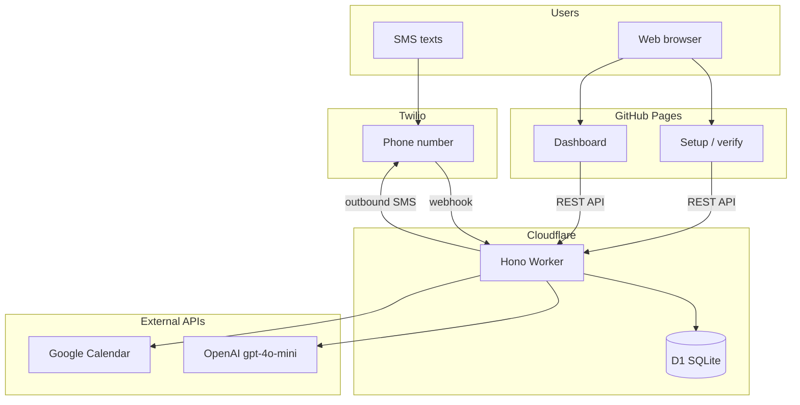

# Brain Agent

[](https://github.com/sfkunal/SophieBot/actions/workflows/deploy-worker.yml)
[](https://github.com/sfkunal/SophieBot/actions/workflows/deploy-web.yml)

**Brain** is a shared SMS assistant for a couple: save restaurants (with cuisine, location, and rationale), build a watchlist (genre and rationale), vote on what’s next, check Google Calendar for mutual free time, and get replies from a warm, funny personality — not a corporate bot.

Full product spec: [docs/product.md](docs/product.md).

## Architecture



**Request path (SMS):** Twilio webhook → intent extraction (OpenAI) → handler (D1) → reply composer (OpenAI) → Twilio outbound.

**Request path (web):** Static Vite app on GitHub Pages calls the Worker API for auth, lists, and calendar data.

## Monorepo structure

```
brain-agent/
├── apps/
│   ├── worker/          # Cloudflare Worker (Hono, Twilio, OpenAI, D1, Google OAuth)
│   └── web/             # Vite static site (setup + dashboard) → GitHub Pages
├── packages/
│   └── shared/          # Types, Zod schemas, LLM prompts (@brain/shared)
├── docs/
│   └── product.md       # Product specification
├── .github/workflows/   # CI deploy pipelines
├── .env.example         # Local / wrangler secret reference
└── package.json         # npm workspaces root
```

| Package | Name | Role |
|---------|------|------|
| `packages/shared` | `@brain/shared` | Shared types, schemas, prompts |
| `apps/worker` | `@brain/worker` | API + SMS + cron on Cloudflare |
| `apps/web` | `@brain/web` | Setup and dashboard UI |

## Prerequisites

- Node.js 20+
- npm 10+
- [Cloudflare](https://dash.cloudflare.com/) account (Workers + D1)
- [Twilio](https://www.twilio.com/) account with an SMS-capable number
- [OpenAI](https://platform.openai.com/) API key
- [Google Cloud](https://console.cloud.google.com/) OAuth client (Calendar scope)
- GitHub repo with Pages enabled (for the web app)

## Setup

### 1. Clone and install

```bash
git clone https://github.com/sfkunal/SophieBot.git
cd SophieBot
npm install
cp .env.example .env
```

### 2. Cloudflare D1

```bash
# Create database (note the database_id for wrangler.toml)
npx wrangler d1 create brain-db

# Update apps/worker/wrangler.toml with your database_id
npm run db:migrate -w @brain/worker          # local
npm run db:migrate:remote -w @brain/worker   # production
```

### 3. Twilio

1. Buy or use an existing SMS number.
2. Set the messaging webhook to `https://<your-worker>.workers.dev/api/sms/inbound` (POST).
3. Copy Account SID, Auth Token, and phone number into secrets (see below).

### 4. OpenAI

Create an API key and set `OPENAI_API_KEY`. The worker uses `gpt-4o-mini` for intent extraction and reply composition.

### 5. Google OAuth

1. Create an OAuth 2.0 client (Web application).
2. Authorized redirect URI: `https://<your-worker>.workers.dev/api/auth/google/callback`
3. Enable the Google Calendar API.
4. Set `GOOGLE_CLIENT_ID`, `GOOGLE_CLIENT_SECRET`, and `GOOGLE_REDIRECT_URI`.

### 6. Allowlist and auth

```bash
# Comma-separated E.164 numbers for the two of you
ALLOWED_PHONES=+15551234567,+15559876543

# Random 32+ char secret for dashboard sessions
AUTH_SECRET=<openssl rand -hex 32>
```

### 7. Worker secrets (production)

```bash
cd apps/worker
npx wrangler secret put TWILIO_ACCOUNT_SID
npx wrangler secret put TWILIO_AUTH_TOKEN
npx wrangler secret put TWILIO_PHONE_NUMBER
npx wrangler secret put OPENAI_API_KEY
npx wrangler secret put GOOGLE_CLIENT_ID
npx wrangler secret put GOOGLE_CLIENT_SECRET
npx wrangler secret put ALLOWED_PHONES
npx wrangler secret put AUTH_SECRET
```

Update `[vars]` in `apps/worker/wrangler.toml`: `APP_URL`, `WEB_URL`, `GOOGLE_REDIRECT_URI`.

### 8. Web app config (GitHub Pages)

```bash
cp apps/web/public/config.example.js apps/web/public/config.js
# Edit API_BASE_URL to your worker URL
```

For CI deploys, set the `WORKER_API_URL` repository secret (see Deployment).

## Local development

```bash
# Terminal 1 — Worker (http://localhost:8787)
npm run dev:worker

# Terminal 2 — Web (http://localhost:5173)
npm run dev:web

# Build everything
npm run build

# Build shared package only
npm run build -w @brain/shared
```

Local web dev uses `apps/web/public/config.js` pointing at `http://localhost:8787`. Use `wrangler dev` with a `.dev.vars` file (same keys as `.env.example`) for secrets.

## Deployment

### Cloudflare Worker (GitHub Actions)

On push to `main`, `.github/workflows/deploy-worker.yml` runs `wrangler deploy`.

**Repository secrets:**

| Secret | Description |
|--------|-------------|
| `CLOUDFLARE_API_TOKEN` | API token with Workers + D1 edit |
| `CLOUDFLARE_ACCOUNT_ID` | Cloudflare account ID |

After first deploy, run remote migrations:

```bash
npm run db:migrate:remote -w @brain/worker
```

### Web app (GitHub Pages)

On push to `main`, `.github/workflows/deploy-web.yml` builds `@brain/web` and publishes to GitHub Pages.

**Setup:**

1. Repo → **Settings** → **Pages** → Source: **GitHub Actions**
2. Repository secret `WORKER_API_URL` = `https://<your-worker>.workers.dev`

The site is served at `https://sfkunal.github.io/SophieBot/`.

### Manual deploy

```bash
npm run deploy:worker
npm run build -w @brain/web
# Upload apps/web/dist to Pages, or push to main to trigger CI
```

## Cost estimate (monthly, two users)

Rough order-of-magnitude for light personal use (~100–300 SMS/month):

| Service | Estimate |
|---------|----------|
| Twilio number | ~$1.15 |
| Twilio SMS (in + out) | ~$2–8 |
| Cloudflare Workers | $0 (free tier) |
| Cloudflare D1 | $0 (free tier) |
| OpenAI gpt-4o-mini | ~$0.50–2 |
| GitHub Pages | $0 |

**Total: ~$4–12/month** depending on message volume. Calendar API calls are free within Google quotas.

## Environment variables

See [.env.example](.env.example) for the full list. Production secrets live in Wrangler (`wrangler secret put`); non-secret URLs go in `wrangler.toml` `[vars]`.

## License

Private / personal use — adjust as needed for your fork.
